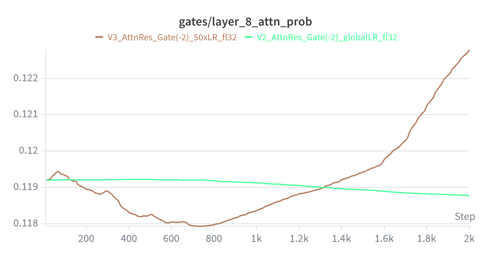
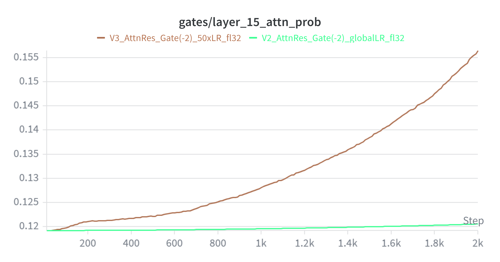
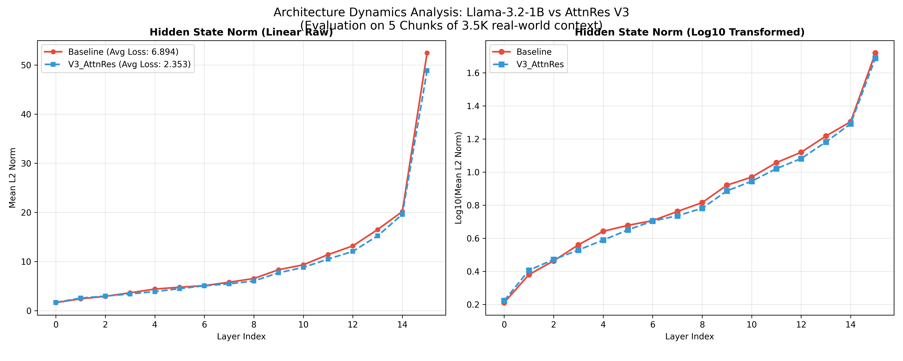

# AttnRes-Llama: Gated Attention Residuals for Llama-3.2-1B

本项目旨在预训练的大语言模型 (Llama-3.2-1B) 上，引入基于 Kimi (*Attention Residuals*, 2025) 思想的长上下文跨层特征融合机制。通过微创手术级别的架构魔改，赋予模型更强的历史信息检索与路由能力。

## 🧠 架构设计：为什么不照搬原论文？

Kimi 原版论文采用了“从零预训练 (From Scratch)”的设定，因此在每个 Block 边界会暴力清空残差主干道，强迫模型依赖 `BlockAttnRes` 来构建上下文。

**本项目的 Trade-off 与创新**：
由于我们是在成熟的 Llama-3.2 上进行微调 (Fine-tuning)，盲目切断残差主干会导致模型瞬间“失忆”（预训练知识丢失、Loss 爆炸）。因此，我们设计了“非侵入式门控融合 (Non-invasive Gated Injection)”：
1. **保留主干**：绝不篡改 Llama 原生的 16 层贯穿式残差主干。
2. **全局视野**：将 AttnRes 融合出的历史特征作为“额外视野”喂给 Attention/MLP 子层。
3. **门控控制**：引入可学习的 Sigmoid 门控参数 (`gate`)，让模型自主决定在当前层吸收多少历史特征，并将增量知识安全地加回原生主干道。

---

## 🚀 探索与演进：V1 到 V3 的实验记录

模型并不是一蹴而就的，我们在实验中经历了关键的动力学调整（完整训练曲线见 `assets/train_loss_(base+3V).png`）：

### ❌ V1：参数下溢与门控失效
* **配置**：`gate` 初始值 -5.0 (权重 ~0.0067)，全局 LR 2e-4，门控采用 `bfloat16`。
* **现象**：Loss=3.981，PPL=53.57。
* **复盘**：由于 `bfloat16` 截断效应，微小的门控梯度在反向传播时下溢为 0，门控参数彻底“死锁”，未能随训练动态更新。

### ⚠️ V2：精度修复但更新迟缓
* **配置**：`gate` 初始值提至 -2.0 (权重 ~0.1192)，门控参数强转 `float32`，全局 LR 2e-4。
* **现象**：Loss=3.999，PPL=54.59。底层与高层门控概率死死卡在 0.118-0.120 之间。
* **复盘**：精度问题解决了，但 2e-4 的基础学习率对一个全新初始化的单参数（Gate）来说太小了，模型来不及在 2000 step 内学会路由历史。

### ✅ V3 (Hero Version)：分组提速与高层觉醒
* **配置**：基础参数 LR=2e-4，**新加的融合器官（门控与权重）赋予 50 倍高优 LR (1e-2)**。
* **现象**：Loss=3.982，PPL=53.64。**门控成功分化！**
  * Layer 0 (底层): 维持在 0.119。
  * Layer 8 (中层): Attn Prob 升至 0.1228。
  * Layer 15 (高层): Attn Prob 暴涨至 **0.15644**，MLP 升至 **0.13087**。
* **结论**：证明 V3 成功引导模型学会了“高层更需要宏观历史视野”的规律，成功盘活了 Attention Residual 机制。

| Layer 8 Attn Prob | Layer 15 Attn Prob |
| :---: | :---: |
|  |  |

*(其他门控演化细节见 assets 目录下的 mlp_prob 图表)*

---

## 📊 长文本评测 (3.5K Context "Needle-In-A-Haystack")

为了验证高层觉醒的门控是否真的提升了长程检索能力，我们在真实Paul Graham Essays (每组3.5K Tokens，5组平均) 上进行了“大海捞针” Target Key Loss 评测。

* **Baseline (Llama-3.2-1B)**: Avg Target Loss **6.894**
* **AttnRes-V3 (Ours)**: Avg Target Loss **2.353**

**物理机制分析 (Internal Dynamics)**：
如下图所示，V3 架构在 Loss 断崖式下降（大幅提升预测精准度）的同时，其各层的 $L_2$ Norm 动力学曲线与 Baseline 几乎完美重叠。这在数学上证明了我们的门控注入方案极其安全，它成功偏转了高维表征的语义方向，但未引发任何特征坍缩或能量爆炸。

---

## 🧗 踩坑实录 (Pitfalls & Solutions)

在复现和魔改底层架构时，我们克服了以下几个工程难题：
1. **RoPE 维度陷阱**：HuggingFace 返回的 `cos`/`sin` 为节省内存常为 Head Dim 的一半。在劫持 `forward` 后必须手动执行 `torch.cat([cos, cos], dim=-1)` 补齐维度，否则会引发矩阵旋转报错。
2. **DDP 幽灵参数**：BlockAttnRes 设定前 3 层由于 `history_cache` 为空不参与计算。这导致 DDP 校验失败。解决方案：在 `DistributedDataParallelKwargs` 中显式开启 `find_unused_parameters=True`。
3. **隐匿的 OOM**：跨层保存特征时若直接 append，会因为保留了完整的计算图导致显存溢出。必须使用 `.detach()` 切断梯度传递。
4. **精度冲突 (Einsum 罢工)**：训练时利用 AMP 混合精度可平稳运行，但纯推理态下 Float32 的门控和 Bfloat16 的输入会导致 `torch.einsum` 崩溃。必须在 Eval 前统一下拉至 `bfloat16` 并挂载至对应 Device。

**^^更多工程上的细节在注释里**

## 🔮 未来展望 (Future Work)

1. **高层逐步 Kimi 化**：目前门控注入是外挂式的。未来计划在高层网络（如 Layer 12-15）加入退火机制，逐步衰减原生 Llama 残差主干的权重，强迫模型完全通过跨层 AttnRes 进行知识融合。
2. **引入 Cross-Attention 机制**：探索将目前基于 `einsum` 的简单加权求和，升级为基于真实 Query-Key 匹配的 Cross-Attention，让当前状态更智能地“检索”历史记忆。

***
**Tks Gemini 、Perplexity 、 Grok**

